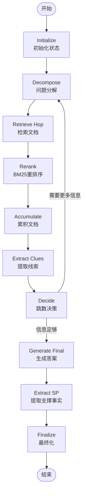

# Hop2Rag 针对 HotpotQA 的设计分析

## 1. HotpotQA 数据集特点

HotpotQA 是一个多跳问答数据集，具有以下特点：

- **多跳推理**：需要跨多篇文档进行联合推理
- **两种问题类型**：
  - **Bridge 问题**：需要通过中间实体桥接（如："A的导演出生在哪里？"需要先找到导演名字，再找出生地）
  - **Comparison 问题**：需要比较两个实体的属性（如："A和B哪个更高？"）
- **Supporting Facts**：要求模型返回支撑答案的句子（格式：`[[title, sentence_idx], ...]`）
- **Full Wiki 设置**：从整个维基百科检索，难度极高

## 2. Hop2Rag 的核心设计

### 2.1 技术选型：为什么选择 LangGraph？

#### LangGraph vs LangChain Agent

**LangGraph 的优势**：

1. **细粒度控制**：
   - LangChain Agent 提供封装好的接口（如 `AgentExecutor`），但内部逻辑是黑盒
   - LangGraph 允许开发者**显式定义**每个节点的行为和状态转换
   - 可以精确控制：何时检索、何时调用 LLM、何时循环、何时终止

2. **自定义决策逻辑**：
   - LangChain Agent 的决策由模型自由发挥（通过 ReAct 等 prompt）
   - LangGraph 可以**编程式控制**决策流程（如 `should_continue_hop` 函数）
   - 支持复杂的条件路由和循环逻辑

3. **状态管理**：
   - LangGraph 提供 `StateGraph`，可以在节点间传递和更新复杂状态
   - 适合多跳推理场景：需要跨跳累积证据、文档、查询历史等

4. **可观测性**：
   - 每个节点和边都可以独立插桩和监控
   - 便于性能分析和调试

**代码对比**：

```python
# LangChain Agent（黑盒）
agent = create_react_agent(llm, tools, prompt)
agent_executor = AgentExecutor(agent=agent, tools=tools)
result = agent_executor.invoke({"input": question})

# LangGraph（白盒，细粒度控制）
workflow = StateGraph(Hop2RagState)
workflow.add_node("decompose", decompose_node)  # 自定义节点
workflow.add_node("retrieve", retrieve_node)
workflow.add_conditional_edge("decide", should_continue_hop, {...})  # 自定义决策
app = workflow.compile()
result = app.invoke({"question": question})
```

#### 手写 Prompt 的必要性

**Hop2Rag 中的 4 个核心 Prompt**：

1. **QUESTION_DECOMPOSER_PROMPT**：问题分解
   ```python
   """You are a question decomposition expert...
   Hop 0: Extract the first entity/concept
   Hop 1+: Based on evidence, determine what to search next
   Return JSON: {"query": "...", "reasoning": "...", "target_entity": "..."}"""
   ```

2. **CLUE_EXTRACTOR_PROMPT**：线索提取
   ```python
   """Extract key entities/clues from retrieved documents...
   For bridge questions: Extract intermediate entity
   For comparison questions: Extract specific attribute
   Return JSON: {"clues": [...], "summary": "..."}"""
   ```

3. **HOP_DECISION_PROMPT**：跳数决策
   ```python
   """Determine if another retrieval hop is needed...
   Answer "yes" if you have sufficient information
   Return JSON: {"decision": "yes/no", "reasoning": "..."}"""
   ```

4. **MULTI_HOP_RAG_PROMPT**：最终答案生成
   ```python
   """Answer a multi-hop question using evidence from multiple retrieval steps...
   === Collected Evidence ===
   === Supporting Documents ==="""
   ```

**为什么不用通用 Prompt？**
- HotpotQA 的多跳推理需要**特定的推理模式**（分解→检索→提取→决策）
- 每个节点的输入输出格式需要精确控制（JSON 结构化输出）
- 需要针对 Bridge/Comparison 问题类型优化提示词

#### 单一模型架构

**Hop2Rag 的设计哲学**：
- 整个流程使用**同一个 LLM**（如 Qwen2.5）完成所有任务
- 不同节点通过**不同的 Prompt** 让模型扮演不同角色：
  - Decompose 节点：模型是"问题分解专家"
  - Extract Clues 节点：模型是"信息提取专家"
  - Decide 节点：模型是"决策专家"
  - Generate 节点：模型是"问答专家"

**优势**：
- **简化部署**：只需部署一个模型服务（vLLM）
- **降低成本**：不需要多个专用模型
- **统一优化**：可以针对单一模型进行 Prefix Cache 等优化
- **一致性**：避免多模型间的风格差异

**实现方式**：
```python
# 全局共享同一个 LLM 实例
def get_llm(json_mode: bool = False):
    global _llm_instance
    if _llm_instance is None:
        _llm_instance = ChatOpenAI(
            base_url="http://localhost:8000/v1",
            model="Qwen2.5",
            temperature=0.0
        )
    return _llm_instance

# 不同节点使用不同 Prompt，但共享同一个 LLM
decomposer = PromptTemplate(...) | get_llm(json_mode=True) | JsonOutputParser()
extractor = PromptTemplate(...) | get_llm(json_mode=True) | JsonOutputParser()
generator = PromptTemplate(...) | get_llm() | StrOutputParser()
```

### 2.2 整体架构

Hop2Rag 使用 **LangGraph** 构建了一个迭代式多跳检索系统：

```
START → Initialize → [Decompose → Retrieve → Rerank → Accumulate → Extract Clues → Decide] → Generate → Extract SP → Finalize → END
                      ↑_______________________________________________________________|
                                        (循环：如果需要更多信息)
```

### 2.3 十大核心节点

#### 节点 1: Initialize（初始化）
```python
def initialize_node(state: Hop2RagState) -> Dict[str, Any]:
```
- **作用**：初始化多跳状态
- **设置**：
  - `current_hop = 0`（从第0跳开始）
  - `max_hops`（最大跳数，默认5）
  - `hop_k`（每跳检索文档数，默认10）
  - 初始化空列表：`hop_queries`, `hop_documents`, `hop_evidence`

#### 节点 2: Decompose（问题分解）
```python
def decompose_node(state: Hop2RagState) -> Dict[str, Any]:
```
- **作用**：将复杂问题分解为当前跳的子查询
- **Prompt 策略**：
  ```
  Hop 0: 提取第一个实体/概念
  Hop 1+: 基于已有证据，决定下一步搜索什么
  ```
- **输出**：生成新的搜索查询（必须与之前的查询不同）
- **特殊处理**：如果 LLM 返回 "DONE"，表示信息已足够，触发提前停止

**示例**：
- 原问题："《盗梦空间》的导演出生在哪里？"
- Hop 0 查询："盗梦空间 导演"
- Hop 1 查询："克里斯托弗·诺兰 出生地"

#### 节点 3: Retrieve Hop（检索文档）
```python
def retrieve_hop_node(state: Hop2RagState) -> Dict[str, Any]:
```
- **作用**：使用当前跳的查询检索文档
- **检索源**：Chroma 向量数据库（HotpotQA Full Wiki）
- **检索数量**：每跳检索 `hop_k` 篇文档（默认10篇）

#### 节点 4: Rerank（重排序）
```python
def rerank_node(state: Hop2RagState) -> Dict[str, Any]:
```
- **作用**：使用 BM25 对检索到的文档重排序
- **查询策略**：结合原问题和当前跳查询
  ```python
  rerank_query = f"{original_question} {hop_query}"
  ```
- **保留策略**：只保留 Top-5 文档

#### 节点 5: Accumulate（累积文档）
```python
def accumulate_node(state: Hop2RagState) -> Dict[str, Any]:
```
- **作用**：跨跳累积相关文档
- **去重策略**：基于 `page_content` 去重
- **限制策略**：每跳最多累积 3 篇新文档
- **目的**：避免文档爆炸，保持上下文可控

#### 节点 6: Extract Clues（提取线索）
```python
def extract_clues_node(state: Hop2RagState) -> Dict[str, Any]:
```
- **作用**：从当前跳的文档中提取关键实体和线索
- **针对 HotpotQA 的设计**：
  - Bridge 问题：提取中间实体（如人名、地名）
  - Comparison 问题：提取要比较的具体属性
- **输出**：
  - `clues`: 关键实体列表
  - `summary`: 简要总结
- **存储**：保存到 `hop_evidence` 和 `intermediate_answers`

#### 节点 7: Decide（跳数决策）
```python
def decide_node(state: Hop2RagState) -> Dict[str, Any]:
```
- **作用**：决定是否需要继续下一跳
- **决策依据**：
  1. 当前已收集的证据是否足够回答问题
  2. 是否达到最大跳数
  3. Decompose 节点是否发出提前停止信号
- **输出**：`decision = "yes"` (足够) 或 `"no"` (需要更多信息)

#### 节点 8: Generate Final（生成最终答案）
```python
def generate_final_node(state: Hop2RagState) -> Dict[str, Any]:
```
- **作用**：基于所有跳的证据生成最终答案
- **输入**：
  - 原始问题
  - 所有跳的证据（`hop_evidence`）
  - 累积的相关文档（`all_graded_documents`）
- **Prompt 策略**：
  ```
  === Collected Evidence ===
  Hop 0: ...
  Hop 1: ...

  === Supporting Documents ===
  Doc 1: ...
  Doc 2: ...
  ```

#### 节点 9: Extract Supporting Facts（提取支撑事实）
```python
def extract_sp_fast_node(state: Hop2RagState) -> Dict[str, Any]:
```
- **作用**：提取 HotpotQA 格式的 supporting facts
- **方法**：使用 BM25 快速选择最相关的句子
- **输出格式**：`[[title, sentence_idx], ...]`
- **HotpotQA 评估要求**：必须返回支撑答案的具体句子

#### 节点 10: Finalize（最终化）
```python
def finalize_node(state: Hop2RagState) -> Dict[str, Any]:
```
- **作用**：整理元数据和最终输出
- **输出**：
  - `final_answer`: 最终答案
  - `supporting_facts`: 支撑事实
  - `metadata`: 包含跳数、查询历史等

### 2.4 条件路由（Conditional Edge）

```python
def should_continue_hop(state: Hop2RagState) -> str:
    if current_hop >= max_hops:
        return "finalize_answer"

    if decision == "yes":  # 信息足够
        return "finalize_answer"
    else:  # 需要更多信息
        return "continue_hop"
```

## 3. 针对 HotpotQA 的关键优化

### 3.1 多跳推理策略

**问题分解（Decompose）**：
- 动态生成每跳的查询
- 避免重复查询
- 支持提前停止（DONE 信号）

**证据累积（Accumulate）**：
- 跨跳保留相关文档
- 去重避免冗余
- 限制文档数量（每跳最多3篇）

### 3.2 Bridge 问题处理

**示例**：谁导演了《盗梦空间》的导演出生的城市？

```
Hop 0: 查询 "盗梦空间 导演"
       → 提取线索: "克里斯托弗·诺兰"

Hop 1: 查询 "克里斯托弗·诺兰 出生地"
       → 提取线索: "伦敦"

Hop 2: 查询 "伦敦 导演"
       → 生成最终答案
```

### 3.3 Comparison 问题处理

**示例**：《盗梦空间》和《星际穿越》哪个票房更高？

```
Hop 0: 查询 "盗梦空间 票房"
       → 提取线索: "8.36亿美元"

Hop 1: 查询 "星际穿越 票房"
       → 提取线索: "6.77亿美元"

决策: 信息足够 → 生成答案: "盗梦空间"
```

### 3.4 Supporting Facts 提取

使用 **BM25 句子选择器**：
1. 将文档分割成句子
2. 计算句子与问题+答案的相关性
3. 选择 Top-M 句子（默认3句）
4. 返回 `[[title, sentence_idx], ...]` 格式

## 4. 性能监控与插桩

### 4.1 节点级插桩

```python
@instrument_node("node_name")
def node_function(state):
    # 自动记录节点耗时
    pass
```

### 4.2 边级插桩

```python
@instrument_edge("edge_name")
def edge_function(state):
    # 自动记录边耗时
    pass
```

### 4.3 LLM 调用追踪

```python
# 记录每次 LLM 调用的 prompt 和 token usage
log_llm_call(request_id, node_name, hop, prompt_text)
```

### 4.4 输出数据

**JSONL 格式**：
```json
{
  "request_id": "uuid",
  "total_ms": 1234.56,
  "total_hops": 2,
  "hop_queries": ["query1", "query2"],
  "aggregated_usage": {
    "prompt_tokens": 1000,
    "completion_tokens": 200,
    "total_tokens": 1200
  },
  "node_ms": {"initialize": 10, "decompose": 500, ...},
  "edge_ms": {"should_continue_hop": 5, ...}
}
```

## 5. 与传统 RAG 的对比

| 特性 | 传统 RAG | Hop2Rag |
|------|---------|---------|
| **检索次数** | 1次 | 多次（动态） |
| **问题处理** | 直接检索 | 分解为子问题 |
| **文档管理** | 单次检索 | 跨跳累积 |
| **推理能力** | 单跳 | 多跳 |
| **适用场景** | 简单问答 | 复杂推理 |
| **HotpotQA 适配** | 差 | 优秀 |

## 6. 工作流可视化



## 7. 关键设计亮点

1. **动态跳数**：根据问题复杂度自适应调整跳数
2. **证据累积**：跨跳保留和去重相关文档
3. **提前停止**：LLM 判断信息足够时提前终止
4. **BM25 重排序**：提高检索精度
5. **Supporting Facts**：满足 HotpotQA 评估要求
6. **性能监控**：完整的插桩和追踪系统
7. **Token 统计**：精确的 LLM 使用量统计

## 8. 使用示例

```python
from Agrag.Rag.hop2_rag import run_hop2_rag

result = run_hop2_rag(
    question="Who is the director of the movie that won Best Picture in 2020?",
    persist_dir="./data/chroma_hotpot_fullwiki",
    collection_name="hotpot_fullwiki",
    k=10,           # 每跳检索10篇文档
    max_hops=5      # 最多5跳
)

print(f"Answer: {result['answer']}")
print(f"Supporting Facts: {result['supporting_facts']}")
print(f"Total Hops: {result['metadata']['total_hops']}")
print(f"Hop Queries: {result['metadata']['hop_queries']}")
```

## 9. 总结

Hop2Rag 是一个专门为 HotpotQA 多跳问答设计的 RAG 系统，通过：
- **迭代式检索**：动态分解问题，逐跳收集证据
- **智能决策**：LLM 判断何时停止检索
- **证据管理**：跨跳累积和去重文档
- **精确追踪**：完整的性能监控和 token 统计

实现了对复杂多跳推理问题的有效处理，特别适合 Bridge 和 Comparison 类型的问题。

## 10. 技术选型对比总结

### LangGraph vs LangChain Agent

| 维度 | LangChain Agent | LangGraph (Hop2Rag) |
|------|----------------|---------------------|
| **控制粒度** | 粗粒度（黑盒） | 细粒度（白盒） |
| **节点定义** | 内置固定流程 | 自定义每个节点 |
| **决策逻辑** | 模型自由发挥 | 编程式精确控制 |
| **循环控制** | 自动（不可控） | 显式条件路由 |
| **状态管理** | 简单 | 复杂状态跨节点传递 |
| **可观测性** | 有限 | 每个节点/边可插桩 |
| **适用场景** | 简单 Agent 任务 | 复杂多步推理 |
| **学习曲线** | 低 | 中等 |

### Prompt 设计策略

| 方面 | 通用 Prompt | Hop2Rag 手写 Prompt |
|------|------------|-------------------|
| **针对性** | 通用场景 | HotpotQA 多跳推理 |
| **结构化输出** | 不保证 | JSON 格式强制 |
| **任务分解** | 模糊 | 明确（Hop 0/1+） |
| **问题类型** | 不区分 | Bridge/Comparison |
| **可控性** | 低 | 高 |
| **维护成本** | 低 | 中等 |

### 模型架构

| 架构 | 多模型 | 单模型 (Hop2Rag) |
|------|--------|-----------------|
| **部署复杂度** | 高（多个服务） | 低（单一 vLLM） |
| **成本** | 高 | 低 |
| **优化难度** | 难（多模型协调） | 易（统一优化） |
| **Prefix Cache** | 难以利用 | 高效利用 |
| **一致性** | 可能不一致 | 统一风格 |
| **灵活性** | 高（专用模型） | 中（Prompt 区分） |

### 核心设计理念

**Hop2Rag 的三大支柱**：

1. **LangGraph 编排**
   - 显式定义工作流图
   - 细粒度控制每个节点和边
   - 支持复杂的条件路由和循环

2. **手写 Prompt**
   - 针对 HotpotQA 特点优化
   - 每个节点有专门的 Prompt
   - 强制 JSON 结构化输出

3. **单一模型**
   - 同一个 LLM 完成所有任务
   - 通过 Prompt 区分角色
   - 简化部署和优化

**这种设计使得 Hop2Rag 在保持灵活性的同时，实现了对多跳推理流程的精确控制和高效执行。**
